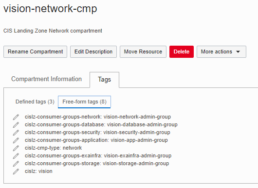

# CIS OCI Landing Zone IAM Policy Module


 This module manages OCI (Oracle Cloud Infrastructure) IAM (Identity and Access Management) policies, providing an RBAC (Role Based Access Control) framework that implements SoD (Separation of Duties) through template policies. Within this implementation, the Least Privilege security principle is enforced, as required by CIS (Center for Internet Security) OCI Foundations Benchmark.

 Check [module specification](./SPEC.md) for a full description of module requirements, supported variables, managed resources and outputs.

 The module operates in two non-exclusive modes: 
 - **Template policies**: this is the preferred mode. Policies are either driven off freeform tags applied to compartments (for compartment level policies) or from supplied roles assigned to groups passed to the module (for tenancy level policies).
 - **Supplied policies**: a map of policies is supplied to the module.

 Regardless the mode, the module checks policy statements against CIS OCI Foundations Benchmark recommendations. For example, the module would not allow a statement like *allow group to manage all-resources in tenancy*.

 ## 1) Template Policies

 In this mode policies are pre-configured, providing SoD across a set of pre-defined group roles. 
 
 Policies scoped at the compartment level are based on freeform tags applied to the compartments. These tags define a specific Landing Zone deployment, the compartment type and consumer groups. The module takes an input variable that is used to lookup the tagged compartments.
 
 Policies scoped at the tenancy level are based on groups roles passed to the module as input parameters.

 ### 1.1) Compartment Level Policies

The following **freeform tags** are required **on the compartments**:

#### cislz

Defines the specific Landing Zone deployment that the compartment belongs to. The assigned value must match the lookup value passed in the module *cislz_tag_lookup_value* input variable.

#### cislz-cmp-type

Defines the compartment's intent, or the resource types it is intended to be assigned. For instance, is it suuposed to be a compartment for network resources, for security resources, for both? 

Currently supported values:

- **security**: drives the creation of security related policies.
- **network**: drives the creation of network related policies.
- **application**: drives the creation of application related policies.
- **database**: drives the creation of database related policies.
- **exainfra**: drives the creation of Exatada Cloud Service related policies.
- **enclosing**: drives the creation of policies that are scoped to more than one compartment, as a compartment tagged as *enclosing* is intended to be the parent of the other compartment types.

Policies are always attached to the compartment itself.

The same compartment can be assigned one to multiple types, as a comma separated list. No policies are created if there is no tag assignment or an invalid value is provided.

Assignment examples: 

- cislz-cmp-type: security,network
- cislz-cmp-type: application,database,exainfra
- cislz-cmp-type: application
- cislz-cmp-type: enclosing

#### cislz-consumer-groups

Defines the groups that use (or consume) resources from the compartment. Since different groups have different roles (or consuming interests), the tag value has to communicate the role of each consuming group. Hence, each consuming group is specified as *\<group-role\>:\<group-name\>*

Currently supported values for *\<group-role\>*:

- **iam**: denotes an interest in IAM related resources.
- **security**: denotes an interest in security related resources.
- **network**: denotes an interest in network related resources.
- **application**: denotes an interest in application related resources.
- **database**:  denotes an interest in database related resources.
- **exainfra**: denotes an interest in Exadata Cloud Service related resources.
- **storage**: denotes an interest in storage related resources.
- **read**: denotes an interest in only reading resources in the compartment.
- **database-kms-dyn**: denotes an interest in key management resources to be consumed by a dynamic group of database instances.
- **compute-agent-dyn**: denotes an interest in resources to be consumed by a dynamic group of compute agents.

*\<group-name\>* can be any local or federated group name.

The same compartment can be assigned multiple consumer groups, as a comma-separated list. No policies are created if there is no tag assignment or an invalid value is provided.

Assignment examples: 

- cislz-consumer-groups: security:cislz-security-admin-group,network:cislz-network-admin-group,application:cislz-application-admin-group,database:cislz-database-admin-group,storage:cislz-storage-admin-group,read:cislz-readonly-group
- cislz-consumer-groups: iam:cislz-iam-admin-group,security:cislz-security-admin-group

**Important**: There is an implied relationship between *cislz-cmp-type* and the *\<group-role\>* in *cislz-consumer-groups* as far as *manage* permissions are concerned, according to table below:

**cislz-cmp-type** | **cislz-consumer-groups' \<group-role\>** | **Policy Outcome**
--------------|-------------|----------
*security* | *security* | *manage* permissions are granted over **security** related resources to *\<group-name\>* with *security* *\<group-role\>*.
*network* | *network* | *manage* permissions are granted over **network** related resources to *\<group-name\>* with *network* *\<group-role\>*.
*application* | *application* | *manage* permissions are granted over **application** related resources to *\<group-name\>* with *application* *\<group-role\>*.
*database* | *database* | *manage* permissions are granted over **database** related resources to *\<group-name\>* with *database* *\<group-role\>*.
*exainfra* | *exainfra* | *manage* permissions are granted over **Exadata Cloud Service** related resources to *\<group-name\>* with *exainfra* *\<group-role\>*.

#### A Concrete Example

As an example, let's assume the following tags are assigned to the *vision-network-cmp* compartment:



- **cislz**: *vision* is the value the module tries to match with provided *cislz_tag_lookup_value* input variable for retrieving the compartment.
- **cislz-cmp-type**: *network* tells the module this compartment is about network resources, hence network policies should be pulled from the pre-configured template.
- **cislz-consumer-groups**: *security:vision-security-admin-group,application:vision-app-admin-group,database:vision-database-admin-group,network:vision-network-admin-group,storage:vision-storage-admin-group,exainfra:vision-exainfra-admin-group* communicates all consumer groups for the compartment resources. Since **cislz-cmp-type** is *network* and we have a group interested in *network* resources, the *vision-network-admin-group* group is granted management permissions on the network resources in the compartment. The other groups are granted permissions that are specific to their roles.

Per applied tags the module attaches the following policy to this compartment:

```
allow group vision-network-admin-group to read all-resources in compartment vision-network-cmp
allow group vision-network-admin-group to manage virtual-network-family in compartment vision-network-cmp
allow group vision-network-admin-group to manage dns in compartment vision-network-cmp
allow group vision-network-admin-group to manage load-balancers in compartment vision-network-cmp
allow group vision-network-admin-group to manage alarms in compartment vision-network-cmp
allow group vision-network-admin-group to manage metrics in compartment vision-network-cmp
allow group vision-network-admin-group to manage ons-family in compartment vision-network-cmp
allow group vision-network-admin-group to manage orm-stacks in compartment vision-network-cmp
allow group vision-network-admin-group to manage orm-jobs in compartment vision-network-cmp
allow group vision-network-admin-group to manage orm-config-source-providers in compartment vision-network-cmp
allow group vision-network-admin-group to read audit-events in compartment vision-network-cmp
allow group vision-network-admin-group to read work-requests in compartment vision-network-cmp
allow group vision-network-admin-group to manage instance-family in compartment vision-network-cmp
allow group vision-network-admin-group to manage volume-family in compartment vision-network-cmp where all{request.permission != 'VOLUME_BACKUP_DELETE', request.permission != 'VOLUME_DELETE', request.permission != 'BOOT_VOLUME_BACKUP_DELETE'}
allow group vision-network-admin-group to manage object-family in compartment vision-network-cmp where all{request.permission != 'OBJECT_DELETE', request.permission != 'BUCKET_DELETE'}
allow group vision-network-admin-group to manage file-family in compartment vision-network-cmp where all{request.permission != 'FILE_SYSTEM_DELETE', request.permission != 'MOUNT_TARGET_DELETE', request.permission != 'EXPORT_SET_DELETE', request.permission != 'FILE_SYSTEM_DELETE_SNAPSHOT', request.permission != 'FILE_SYSTEM_NFSv3_UNEXPORT'}
allow group vision-network-admin-group to manage bastion-session in compartment vision-network-cmp
allow group vision-network-admin-group to manage cloudevents-rules in compartment vision-network-cmp
allow group vision-network-admin-group to manage alarms in compartment vision-network-cmp
allow group vision-network-admin-group to manage metrics in compartment vision-network-cmp
allow group vision-network-admin-group to read instance-agent-plugins in compartment vision-network-cmp
allow group vision-security-admin-group to read virtual-network-family in compartment vision-network-cmp
allow group vision-security-admin-group to use subnets in compartment vision-network-cmp
allow group vision-security-admin-group to use network-security-groups in compartment vision-network-cmp
allow group vision-security-admin-group to use vnics in compartment vision-network-cmp
allow group vision-app-admin-group to read virtual-network-family in compartment vision-network-cmp
allow group vision-app-admin-group to use subnets in compartment vision-network-cmp
allow group vision-app-admin-group to use network-security-groups in compartment vision-network-cmp
allow group vision-app-admin-group to use vnics in compartment vision-network-cmp
allow group vision-app-admin-group to use load-balancers in compartment vision-network-cmp
allow group vision-database-admin-group to read virtual-network-family in compartment vision-network-cmp
allow group vision-database-admin-group to use vnics in compartment vision-network-cmp
allow group vision-database-admin-group to use subnets in compartment vision-network-cmp
allow group vision-database-admin-group to use network-security-groups in compartment vision-network-cmp
allow group vision-exainfra-admin-group to read virtual-network-family in compartment vision-network-cmp
allow group vision-storage-admin-group to read bucket in compartment vision-network-cmp
allow group vision-storage-admin-group to inspect object in compartment vision-network-cmp
allow group vision-storage-admin-group to manage object-family in compartment vision-network-cmp where any {request.permission = 'OBJECT_DELETE', request.permission = 'BUCKET_DELETE'}
allow group vision-storage-admin-group to read volume-family in compartment vision-network-cmp
allow group vision-storage-admin-group to manage volume-family in compartment vision-network-cmp where any {request.permission = 'VOLUME_DELETE', request.permission = 'VOLUME_BACKUP_DELETE', request.permission = 'BOOT_VOLUME_BACKUP_DELETE'}
allow group vision-storage-admin-group to read file-family in compartment vision-network-cmp
allow group vision-storage-admin-group to manage file-family in compartment vision-network-cmp where any {request.permission = 'FILE_SYSTEM_DELETE', request.permission = 'MOUNT_TARGET_DELETE', request.permission = 'VNIC_DELETE', request.permission = 'SUBNET_DETACH', request.permission = 'VNIC_DETACH', request.permission = 'PRIVATE_IP_DELETE', request.permission = 'PRIVATE_IP_UNASSIGN', request.permission = 'VNIC_UNASSIGN', request.permission = 'EXPORT_SET_UPDATE', request.permission = 'FILE_SYSTEM_NFSv3_UNEXPORT', request.permission = 'EXPORT_SET_DELETE', request.permission = 'FILE_SYSTEM_DELETE_SNAPSHOT'}
```

### 1.2) Tenancy Level Policies

Tenancy level policies are not based off compartment tags because they are applied at the root compartment level. Per design we decided not to tag the root compartment for policy configuration. Instead, tenancy level policies are configured per group roles passed into the module as input through *groups_with_tenancy_level_roles* variable.

Supported tenancy level roles:

- **iam**: grants IAM related admin permissions at the tenancy level.
- **cost**: grants cost related admin permissions at the tenancy level.
- **cred**: grants credential related admin permissions at the tenancy level.
- **security**: grants security related admin permissions at the tenancy level.
- **application**: grants (read-only) application related permissions at the tenancy level.
- **auditor**: grants (read-only) auditing permissions at the tenancy level.
- **announcement-reader**: grants announcement reading permissions at the tenancy level.
- **basic**: grants simple basic permissions at the tenancy level, specifically the ability to use cloud-shell and read usage-budgets.

As OCI supports 50 statements per policy, tenancy level grants are split into two policies: one for all groups with manage/use permissions over at least one resource and one for groups with only read/inspect + basic role permissions.

#### A Concrete Example

As an example, let's assume the following *groups_with_tenancy_level_roles* variable is passed to the module:

```
groups_with_tenancy_level_roles = [
    {"name":"vision-iam-admin-group",     "roles":"iam"},
    {"name":"vision-cred-admin-group",    "roles":"cred"},
    {"name":"vision-cost-admin-group",    "roles":"cost"},
    {"name":"vision-security-admin-group","roles":"security"},
    {"name":"vision-app-admin-group",     "roles":"application"},
    {"name":"vision-auditor-group",       "roles":"auditor"},
    {"name":"vision-announcement_reader-group","roles":"announcement-reader"},
    {"name":"vision-database-admin-group","roles":"basic"},
    {"name":"vision-exainfra-admin-group","roles":"basic"},
    {"name":"vision-storage-admin-group", "roles":"basic"}
  ]
```
The following two policies would be attached to the root compartment.

Policy with manage/use permissions:

```
define tenancy usage-report as ocid1.tenancy.oc1..aaaaaaaaned4fkpkisbwjlr56u7cj63lf3wffbilvqknstgtvzub7vhqkggq
allow group vision-cost-admin-group to manage usage-report in tenancy
allow group vision-cost-admin-group to manage usage-budgets in tenancy
endorse group vision-cost-admin-group to read objects in tenancy usage-report
allow group vision-iam-admin-group to inspect users in tenancy
allow group vision-iam-admin-group to inspect groups in tenancy
allow group vision-iam-admin-group to read policies in tenancy
allow group vision-iam-admin-group to manage groups in tenancy where all {target.group.name != 'Administrators', target.group.name != 'vision-cred-admin-group'}
allow group vision-iam-admin-group to inspect identity-providers in tenancy
allow group vision-iam-admin-group to manage identity-providers in tenancy where any {request.operation = 'AddIdpGroupMapping', request.operation = 'DeleteIdpGroupMapping'}
allow group vision-iam-admin-group to manage dynamic-groups in tenancy
allow group vision-iam-admin-group to manage authentication-policies in tenancy
allow group vision-iam-admin-group to manage network-sources in tenancy
allow group vision-iam-admin-group to manage quota in tenancy
allow group vision-iam-admin-group to read audit-events in tenancy
allow group vision-iam-admin-group to manage tag-defaults in tenancy
allow group vision-iam-admin-group to manage tag-namespaces in tenancy
allow group vision-iam-admin-group to manage orm-stacks in tenancy
allow group vision-iam-admin-group to manage orm-jobs in tenancy
allow group vision-iam-admin-group to manage orm-config-source-providers in tenancy
allow group vision-cred-admin-group to inspect users in tenancy
allow group vision-cred-admin-group to inspect groups in tenancy
allow group vision-cred-admin-group to manage users in tenancy  where any {request.operation = 'ListApiKeys',request.operation = 'ListAuthTokens',request.operation = 'ListCustomerSecretKeys',request.operation = 'UploadApiKey',request.operation = 'DeleteApiKey',request.operation = 'UpdateAuthToken',request.operation = 'CreateAuthToken',request.operation = 'DeleteAuthToken',request.operation = 'CreateSecretKey',request.operation = 'UpdateCustomerSecretKey',request.operation = 'DeleteCustomerSecretKey',request.operation = 'UpdateUserCapabilities'}
allow group vision-security-admin-group to manage cloudevents-rules in tenancy
allow group vision-security-admin-group to manage cloud-guard-family in tenancy
allow group vision-security-admin-group to read tenancies in tenancy
allow group vision-security-admin-group to read objectstorage-namespaces in tenancy
```

Policy with read/inspect + basic role permissions:

```
allow group vision-announcement_reader-group,vision-app-admin-group,vision-auditor-group,vision-cost-admin-group,vision-cred-admin-group,vision-database-admin-group,vision-exainfra-admin-group,vision-iam-admin-group,vision-security-admin-group,vision-storage-admin-group to use cloud-shell in tenancy
allow group vision-announcement_reader-group,vision-app-admin-group,vision-auditor-group,vision-cost-admin-group,vision-cred-admin-group,vision-database-admin-group,vision-exainfra-admin-group,vision-iam-admin-group,vision-security-admin-group,vision-storage-admin-group to read usage-budgets in tenancy
allow group vision-auditor-group to inspect all-resources in tenancy
allow group vision-auditor-group to read instances in tenancy
allow group vision-auditor-group to read load-balancers in tenancy
allow group vision-auditor-group to read buckets in tenancy
allow group vision-auditor-group to read nat-gateways in tenancy
allow group vision-auditor-group to read public-ips in tenancy
allow group vision-auditor-group to read file-family in tenancy
allow group vision-auditor-group to read instance-configurations in tenancy
allow group vision-auditor-group to read network-security-groups in tenancy
allow group vision-auditor-group to read resource-availability in tenancy
allow group vision-auditor-group to read audit-events in tenancy
allow group vision-auditor-group to read users in tenancy
allow group vision-auditor-group to read vss-family in tenancy
allow group vision-auditor-group to read data-safe-family in tenancy
allow group vision-announcement_reader-group to read announcements in tenancy
```

## 2) Supplied Policies

In this mode, policies are provided as an input parameter and can supplement or completely override the template policies.

For completely overriding the template policies, set variables *enable_compartment_level_template_policies* and *enable_tenancy_level_template_policies* to false."

Supplied policies are defined using the *custom_policies* map variable.

 

